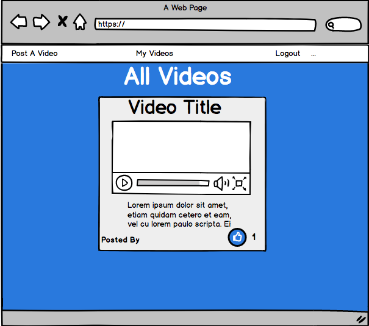
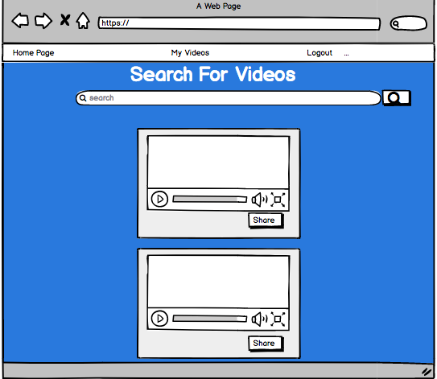
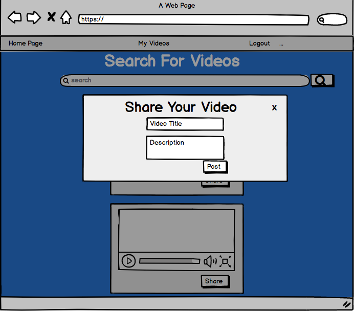
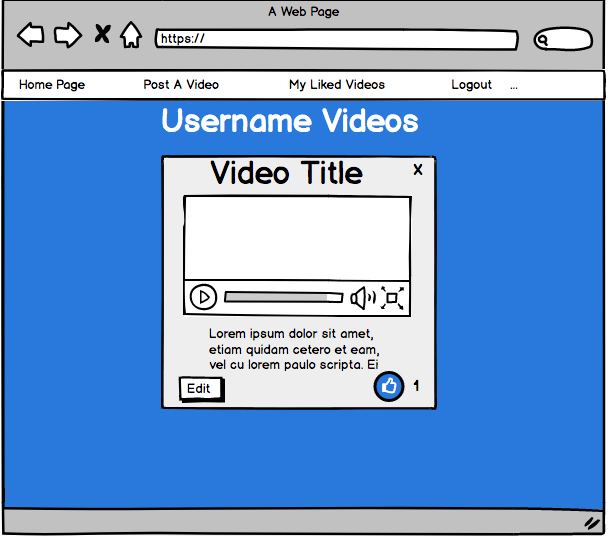
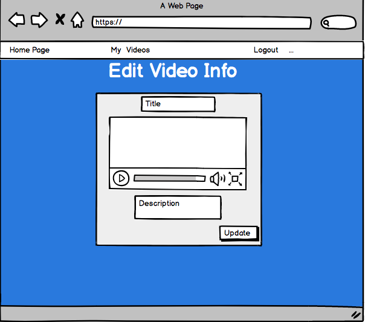
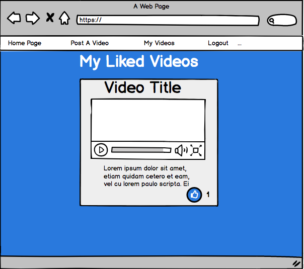

# Project-2-Video-App
### by Amjad Ali and Alyssa Graham
#### [wdi-chi-curious-turtles Project-2](https://github.com/ga-chicago/Project-2/)

This was a pair project building a full-stack Express application for General Assembly's Web Development Immersive Course.

## Project: Vide-ojo
Vide-ojo is a video sharing site. Users can create an account or log in to search for and share videos. Users search for videos, add a title and description, and add them to their My Videos page. A user can remove videos they no longer wishes to include on their My Videos page or edit the title and description they previously wrote.

Our site connects to youtube's API in order to search videos.

## User Stories and WireFrames:
	1. User can create an account or log in.
	
	2. After log in, user sees index of all videos posted by users in the database.
	... User can click on options to Post a Video, view My Videos, or Log Out.
	... User can scroll through all videos posted and like different videos.
	
	3. User can search for videos to share to their page. 
	
	4. Once user clicks share, popup box for user to add title and description of the video.
	
	5. Page for user to see all of their shared videos.
	
	6. User can edit the title and description they previously added to a video.
	
	7. User can views page of videos that they've "liked."
	

## Technologies Used:
	- Nodejs / Express
	- API connection
	- Ajax
	- JavaScript / jQuery
	- CSS

## Problems Overcame:
	- Working together to review any merge conflicts.
	- When a user edits video title and description, getting updates to reflect on both the index page and the My Videos page.
	- Getting number of likes to reflect on the My Videos page.
	- Linking to other user's My Videos page from the index page through the "Posted by" text.
	- Use of flexbox to style log in page.

## Things to Add in Future:
	- Allow users to comment on videos posted.
	- Ability to add a video to your My Videos page from the index page.
	- Ability for users to upload a profile picture.
	- When user clicks on the "X" to delete a video, include delete confirmation "Are you sure you want to delete this video?".